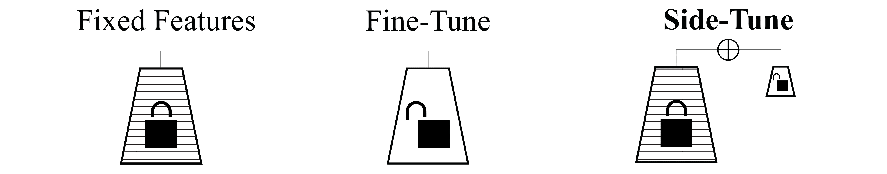
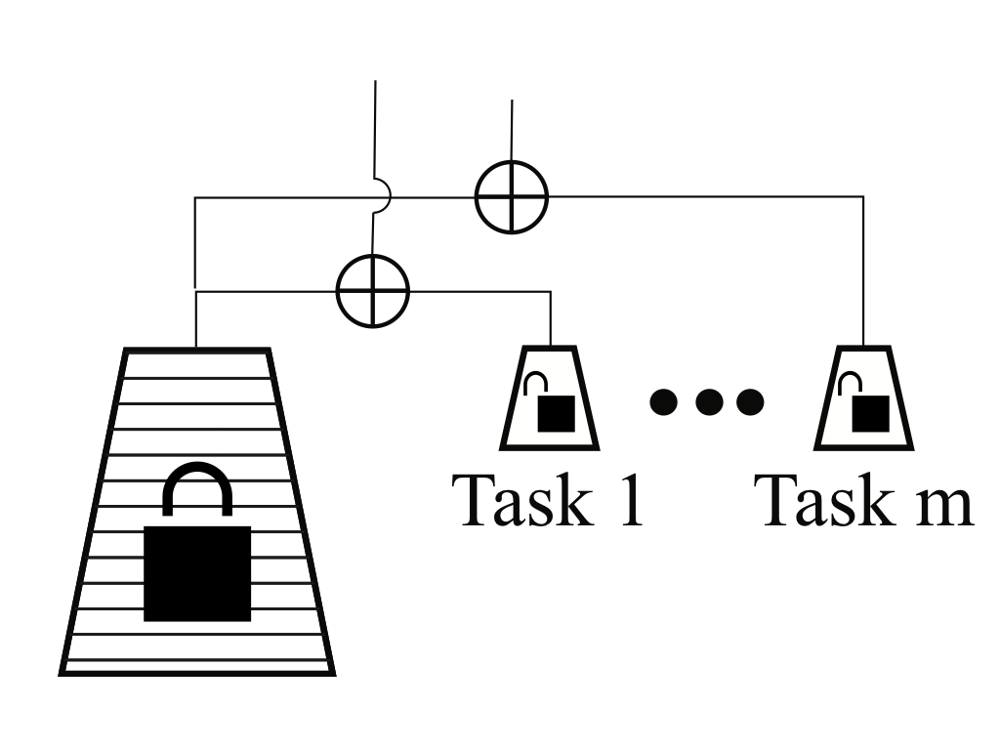
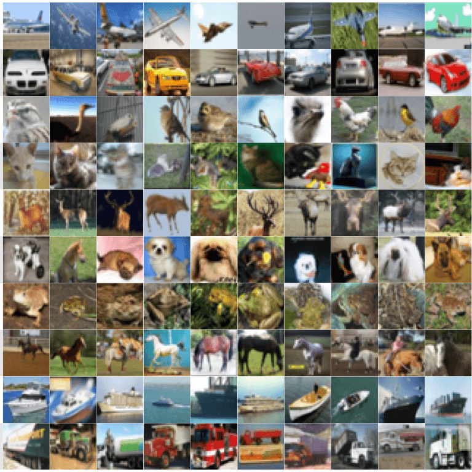
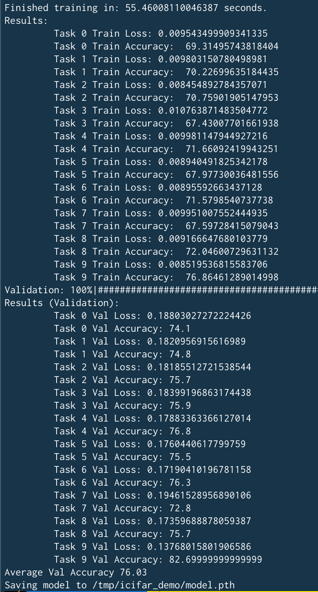
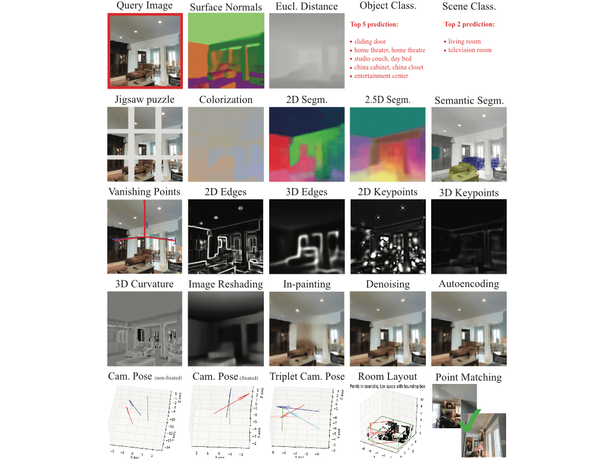
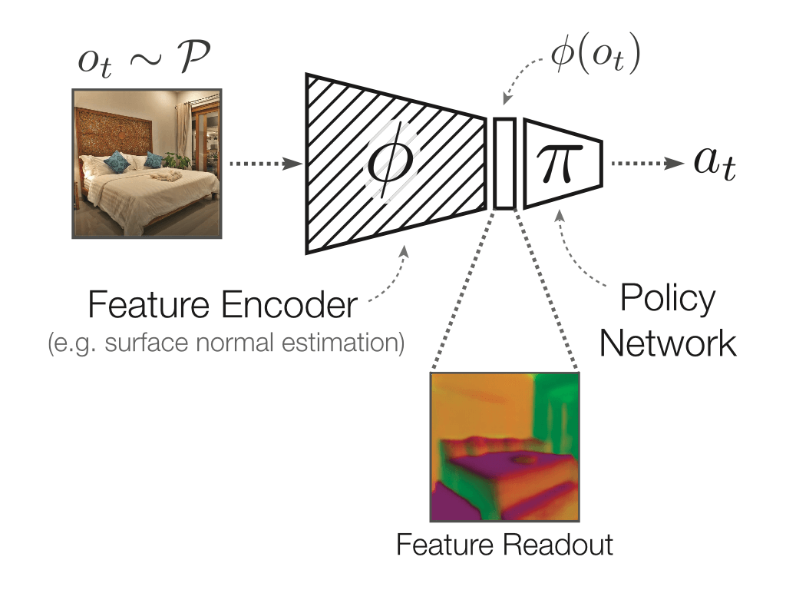

# `Side-tuning`: Network Adaptation via Additive Side Networks</h1>

<div align="center">
  
</div>

**Summary:** When training a neural network for a desired task, one may prefer to adapt a pretrained network rather than start with a randomly initialized one -- due to lacking enough training data, performing lifelong learning where the system has to learn a new task while being previously trained for other tasks, or wishing to encode priors in the network via preset weights. The most commonly employed approaches for network adaptation are fine-tuning and using the pre-trained network as a fixed feature extractor, among others. 

In this paper we propose a straightforward alternative: Side-Tuning. Side-tuning adapts a pretrained network by training a lightweight "side" network that is fused with the (unchanged) pretrained network using a simple additive process. This simple method works as well as or better than existing solutions while it resolves some of the basic issues with fine-tuning, fixed features, and several other common baselines. In particular, side-tuning is less prone to overfitting when little training data is available, yields better results than using a fixed feature extractor, and doesn't suffer from catastrophic forgetting in lifelong learning.  We demonstrate the performance of side-tuning under a diverse set of scenarios, including lifelong learning (iCIFAR, Taskonomy), reinforcement learning, imitation learning (visual navigation in Habitat), NLP question-answering (SQuAD v2), and single-task transfer learning (Taskonomy), with consistently promising results.

This repository includes [code](https://github.com/jozhang97/side-tuning/tree/master/tlkit) from the paper, [ready-made dockers](#running-experiments-) containing pre-built environments, and commands to [run our experiments](#running-experiments-).

Please see the website [sidetuning.berkeley.edu](http://sidetuning.berkeley.edu) for more technical details. This repository is intended for distribution of the code, environments, and installation/running instructions.

#### Paper

[**Side-Tuning: Network Adaptation via Additive Side Networks**,](https://arxiv.org/abs/1912.13503)<br>
_Arxiv 2019_.<br>
Jeffrey O. Zhang, Alexander Sax, Amir Zamir, Leonidas Guibas, Jitendra Malik.
<br>

## Contents 
- [Quickstart](#quickstart-)
- [Running experiments](#running-experiments-)
- [Distillations](#distillations-)
- [Citation](#citation-)
- [References](#references-)

<br>

## Quickstart [\[^\]](#Contents)
Here, we will start on training a Side-tuning agent on the lifelong learning datasets - incremental CIFAR and Taskonomy. In this setting, we train on a sequence of tasks and evaluate the performance of all tasks at the end of training. After a task has past, the agent never sees any more training data for the task (and is expected to perform on the validation set).
In this setting, we are interested in performance, forward transfer (to new tasks) and catastrophic forgetting (or lack thereof).

Pictorially, here is what Side-tuning on lifelong learning tasks looks like:
<div align="center">
  
</div>


You will need CUDA, Python 3.6+ and standard python libraries (e.g. torch, torchvision, numpy, tqdm, tensorboardX) on your machine. You may run into "Permission Denied" errors - these can often be fixed by `chown -R CUR_USER FILE_NAME` or `chmod -R 700 FILE_NAME`.
<div align="center">
  
</div>

### iCIFAR
We train our side-tuning agent on the iCIFAR lifelong learning dataset - a dataset constructed by taking CIFAR-100 and randomly partitioning the classes into 10 sets of 10 tasks and then defining a sequence on the set. 
For our base model, we use a ResNet-44 and for our side model, a 4 layer fully convolutional network. The ResNet-44 is pretrained on CIFAR-10 and the 4 layer FCN is distilled from the ResNet-44.
```
git clone https://github.com/jozhang97/side-tuning.git              # get our repo
cd side-tuning/tnt && pip install -e . && cd ..                     # install tnt, our logger
python -m scripts.demo_icifar                                       # run script!
```
The expected average accuracy is ~76%. Picture of Expected output:

<div align="center">
  
</div>  

<br />
<br />
<br />
<br />
<br />
<br />
<br />
<br />
<br />
<br />
<br />
<br />
<br />
<br />
<br />
<br />


### Taskonomy
We train our side-tuning agent on select tasks in the Taskonomy dataset.
For our base model, we use a ResNet-50 and for our side model, a 5 layer fully convolutional network. The ResNet-50 is pretrained on the curvature estimation task and the 5 layer FCN is distilled from the ResNet-50.

Note: This only uses a single building from the Taskonomy dataset (data sample), for simplicity and fast start up.

<div align="center">
  
</div>

```
git clone https://github.com/jozhang97/side-tuning.git              # get our repo
cd side-tuning/tnt && pip install -e . && cd ..                     # install tnt, our logger
git clone https://github.com/alexsax/taskonomy-sample-model-1.git   # get single building Taskonomy data
git clone --single-branch --branch pretrained-networks https://github.com/jozhang97/side-tuning.git  # get pretrained models
python -m scripts.demo_taskonomy                                    # run script!
```

## Running experiments [\[^\]](#Contents)

We provide dockers to reproduce and extend our results. Setting up these environments can be a pain, and docker provides a containerized environment with the environments already set up. If not already installed, install [Docker](https://docs.docker.com/install/) and [Nvidia-Docker](https://github.com/NVIDIA/nvidia-docker#quickstart).

#### Step 1) Install the docker
In a shell, pull the docker to your local machine 
``` bash
docker pull jozhang97/side-tuning:v1.0
```

#### Step 2) Start up a docker container
Once the docker is installed you can start a new container. The following command will start a new container.
``` bash
docker run --runtime=nvidia -it --rm --shm-size 512G jozhang97/side-tuning:v1.0 /bin/bash
```

#### Step 3) Run the experiment
**Lifelong Learning**

Taskonomy [4]

Note: For Taskonomy data, please see [here](https://github.com/StanfordVL/taskonomy/tree/master/data) (tldr: get sample building data at [here](https://github.com/alexsax/taskonomy-sample-model-1), contact authors for full dataset). Note their "principal_curvature" is equivalent to our "curvature".

Construct valid masks (parts of the image we want to apply loss to for pix-to-pix tasks, this is for sample building):
```
python -m scripts.prep.make_masks make_mask with data_dir='/mnt/data/taskonomy-sample-model-1' save_dir='/mnt/data/taskonomy-sample-model-1'
```

```
./scripts/run_lifelong_taskonomy.sh sidetune std 12                 # Side-tuning
./scripts/run_lifelong_taskonomy.sh independent std 12              # Independent Networks
./scripts/run_lifelong_taskonomy.sh finetune std 12                 # Fine-tuning
./scripts/run_lifelong_taskonomy.sh features std 12                 # Feature Extraction

./scripts/run_lifelong_taskonomy.sh finetune std 12 bsp             # Parameter Superposition (Binary Superposition) [1]
./scripts/run_lifelong_taskonomy.sh finetune std 12 ewc 0           # Elastic Weight Consolidation [2]
./scripts/run_lifelong_taskonomy.sh sidetune std 12 pnn_v4_mlp      # Progressive Neural Networks [3]
```

iCIFAR
```
./scripts/run_lifelong_cifar.sh sidetune                            # Side-tuning
./scripts/run_lifelong_cifar.sh sidetune merge_mlp                  # Side-tuning (MLP Adapter)
./scripts/run_lifelong_cifar.sh independent                         # Independent Networks
./scripts/run_lifelong_cifar.sh finetune                            # Fine-tuning
./scripts/run_lifelong_cifar.sh features                            # Feature Extraction

./scripts/run_lifelong_cifar.sh finetune bsp_cifar                  # Parameter Superposition (Binary Superposition) [1]
./scripts/run_lifelong_cifar.sh finetune ewc 4                      # Elastic Weight Consolidation [2]
./scripts/run_lifelong_cifar.sh sidetune pnn_v4_cifar               # Progressive Neural Networks [3]
```

<div align="center">
  
</div>

**RL**
```
CUDA_VISIBLE_DEVICES=0,1 ./scripts/run_rl_exps.sh small_settings5 sidetune curvature
CUDA_VISIBLE_DEVICES=0,1 ./scripts/run_rl_exps.sh small_settings5 finetune curvature
CUDA_VISIBLE_DEVICES=0,1 ./scripts/run_rl_exps.sh small_settings5 feat curvature
CUDA_VISIBLE_DEVICES=0,1 ./scripts/run_rl_exps.sh small_settings5 scratch curvature
```
**Note**: You might see some NaNs in the first iteration. Not to worry! This is probably because the first logging occurs before any episodes have finished.

**Imitation Learning**
```
# Tiny Dataset - 49 trajectories, 2581 frames
## Collect Data
python -m scripts.prep.collect_expert_trajs tiny 10000 train /mnt/data/expert_trajs   # this should take about 20 minutes
python -m scripts.prep.collect_expert_trajs tiny 1     val   /mnt/data/expert_trajs   # this should take about 40 minutes
## Experiments
ln -s /mnt/data/expert_trajs/tiny/val /mnt/data/expert_trajs/tiny/test
./scripts/run_il_exps.sh tiny sidetune curvature
./scripts/run_il_exps.sh tiny feat curvature
./scripts/run_il_exps.sh tiny finetune curvature
./scripts/run_il_exps.sh tiny scratch curvature


# Largeplus Dataset - 49325 trajectories, 2813750 frames
## Collect Data
python -m scripts.prep.collect_expert_trajs largeplus 1 train /mnt/data/expert_trajs    # this will take ~2 days...
python -m scripts.prep.collect_expert_trajs largeplus 1 val   /mnt/data/expert_trajs    # this should take about 40 minutes
ln -s /mnt/data/expert_trajs/largeplus/val /mnt/data/expert_trajs/largeplus/test
## Experiments
./scripts/run_il_exps.sh largeplus sidetune curvature
./scripts/run_il_exps.sh largeplus finetune curvature
./scripts/run_il_exps.sh largeplus feat curvature
./scripts/run_il_exps.sh largeplus scratch curvature
```


**Vision**

Load Taskonomy data to `/mnt/data/tiny` and models to `/mnt/models`.
```
./scripts/run_vision_transfer.sh curvature normal few100   sidetune     # Curvature -> Normal, train with 100 images
./scripts/run_vision_transfer.sh curvature normal fullplus sidetune     # Curvature -> Normal, train with 4M images
```
You can also try using different source and target tasks! See the script for more information.

Note: Do not worry about "UserWarning: Couldn't retrieve source code for container of type X" warnings. These are due to change of the code from an earlier state.

You can explore more configuration options in `./configs`! We used [SACRED](https://sacred.readthedocs.io/en/latest/) for managing experiments, so any of these experiments can be easily modified from the command line.


## Distillations [\[^\]](#Contents)
Found on the `pretrained-networks` branch.
We provide distillations of ResNet-50s into 5-layer convolutional networks for the following Taskonomy tasks
```
autoencoding          depth_euclidean          normal
curvature             depth_zbuffer            keypoints2d
class_object          edge_occlusion           keypoints3d
denoising             edge_texture             reshading
```
A description of each of the features is contained in the supplementary of [Taskonomy](http://taskonomy.vision).
We also provide distillations of ResNet-44 into a 4-layer convolutional network for CIFAR-10.
Note: The names of the Taskonomy distillations are `TASK_NAME-distilled.pth`, but our code names them `TASK_NAME_encoder_student.pth`

## Citation [\[^\]](#Contents)

If you find this repository or toolkit useful, then please cite:
```
@inproceedings{sidetuning2019,
    title={Side-tuning: Network Adaptation via Additive Side Networks},
    author={Jeffrey O. Zhang and Alexander Sax and Amir Zamir and Leonidas J. Guibas and Jitendra Malik},
    year={2019},
}
```

## References [\[^\]](#Contents)
[1] Brian Cheung, Alex Terekhov, Yubei Chen, Pulkit Agrawal, and Bruno A. Olshausen. Superposition of many models into one. NeuroIPS 2019.

[2] James Kirkpatrick, Razvan Pascanu, Neil C. Rabinowitz, Joel Veness, Guillaume Desjardins, Andrei A. Rusu, Kieran Milan, John Quan, Tiago Ramalho, Agnieszka Grabska- Barwinska, Demis Hassabis, Claudia Clopath, Dharshan Ku- maran, and Raia Hadsell. Overcoming catastrophic forget- ting in neural networks. CoRR, abs/1612.00796, 2016.

[3] Andrei A. Rusu, Neil C. Rabinowitz, Guillaume Desjardins, Hubert Soyer, James Kirkpatrick, Koray Kavukcuoglu, Raz- van Pascanu, and Raia Hadsell. Progressive neural networks. CoRR, abs/1606.04671, 2016.

[4] Amir R. Zamir and Alexander Sax and William B. Shen and Leonidas J. Guibas and Jitendra Malik and Silvio Savarese. Taskonomy: Disentangling Task Transfer Learning. CVPR 2018.
